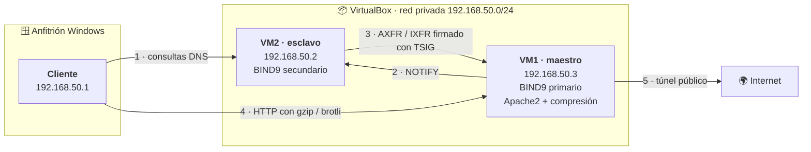

<div align="center">

# 🌐 Parcial 1 — Servicios Telemáticos

### Microproyecto integrador
**DNS tolerante a fallos · Optimización de tráfico web · Publicación segura**


</div>

---

## 📑 Contenido

| Sección | Qué encontrarás |
| :--- | :--- |
| [🎯 Descripción](#-descripción) | De qué se trata el proyecto |
| [🏗️ Arquitectura](#️-arquitectura) | Diagrama de la infraestructura |
| [🖥️ Infraestructura](#️-infraestructura) | Máquinas, IPs y servicios |
| [🗂️ Estructura del repositorio](#️-estructura-del-repositorio) | Dónde está cada archivo |
| [🚀 Puesta en marcha](#-puesta-en-marcha) | Cómo levantar el entorno |
| [📦 Contenido por parte](#-contenido-por-parte) | Detalle de las tres partes |
| [✅ Estado del proyecto](#-estado-del-proyecto) | Avance por requisito |
| [👥 Integrantes](#-integrantes) | Quiénes lo desarrollaron |
| [🤖 Declaración de uso de IA](#-declaración-de-uso-de-asistentes-de-ia) | Transparencia académica |

---

## 🎯 Descripción

Este repositorio contiene la implementación completa de la infraestructura de red
de la empresa ficticia **`empresa.local`**, montada sobre dos máquinas virtuales
Ubuntu Server gestionadas con Vagrant y VirtualBox.

El proyecto se compone de tres partes que **se construyen sobre la misma
infraestructura**, no son ejercicios independientes:

> 🏢 **Parte 1** — Un servidor DNS con su respaldo automático y autenticado, capaz de
> seguir respondiendo aunque el servidor principal se caiga.
>
> 📦 **Parte 2** — Un servidor web que comprime sus recursos antes de transmitirlos,
> comparando experimentalmente dos algoritmos distintos.
>
> 🌍 **Parte 3** — La publicación de ese servidor web en Internet a través de un
> túnel seguro.

---

## 🏗️ Arquitectura



> [!IMPORTANT]
> El cliente resuelve nombres **únicamente a través del esclavo**. Nunca consulta
> directamente al maestro. Esta separación es lo que permite demostrar la
> **continuidad del servicio**: al apagar el maestro, el cliente sigue resolviendo.

---

## 🖥️ Infraestructura

| Rol | Hostname | IP | RAM | Servicios |
| :--- | :--- | :--- | :--- | :--- |
| 🔴 **VM1 — DNS maestro** | `maestro` | `192.168.50.3` | 2048 MB | BIND9 *(primario)*, Apache2 |
| 🔵 **VM2 — DNS esclavo** | `esclavo` | `192.168.50.2` | 1024 MB | BIND9 *(secundario)* |
| 🪟 **Cliente** | Anfitrión Windows | `192.168.50.1` | — | `dig`, `nslookup`, navegador, Wireshark |

<table>
<tr><td>🌍 <b>Dominio</b></td><td><code>empresa.local</code></td></tr>
<tr><td>🔁 <b>Zona inversa</b></td><td><code>50.168.192.in-addr.arpa</code></td></tr>
<tr><td>🕸️ <b>Sitio web</b></td><td><code>parcial.empresa.local</code></td></tr>
<tr><td>💿 <b>Box base</b></td><td><code>bento/ubuntu-22.04</code></td></tr>
</table>

---

## 🗂️ Estructura del repositorio

```text
.
├── 📄 Vagrantfile                  Definición de las dos máquinas virtuales
├── 📄 README.md                    Este archivo
│
├── 📁 parte-1-dns/                 🔴 DNS maestro/esclavo — 2.0 pts
│   ├── maestro/                    named.conf.*, db.empresa.local, db.192.168.50
│   ├── esclavo/                    named.conf.* del servidor secundario
│   ├── tsig/                       Clave simétrica de transferencia
│   ├── comandos/                   Comandos de prueba y verificación
│   └── logs/                       Muestras de los logs de auditoría
│
├── 📁 parte-2-compresion/          🔵 Compresión en Apache — 2.0 pts
│   ├── apache/                     deflate.conf, brotli.conf, VirtualHost
│   ├── sitio/                      Recursos de prueba por tipo de archivo
│   ├── scripts/                    Medición automatizada con curl
│   └── resultados/                 Tabla comparativa y análisis crítico
│
└── 📁 parte-3-tunel/               🟢 Publicación segura — 1.0 pt
    └──                             Página personalizada y comandos del túnel
```

---

## 🚀 Puesta en marcha

```bash
# 1 · Levantar las máquinas virtuales
vagrant up maestro
vagrant up esclavo

# 2 · Entrar a cada una
vagrant ssh maestro
vagrant ssh esclavo
```

> [!NOTE]
> La carpeta del proyecto se sincroniza automáticamente en `/vagrant` dentro de
> cada VM. Por eso los archivos de configuración se copian directamente al
> repositorio desde la propia máquina virtual.

---

## 📦 Contenido por parte

<details>
<summary><b>🔴 Parte 1 — DNS Maestro/Esclavo</b> · 2.0 pts</summary>

<br/>

Servidor DNS autoritativo con réplica automática, resolución directa e inversa,
transferencia de zona autenticada y endurecimiento de seguridad.

**Implementa:**

- Zona directa `empresa.local` con registros `A`, `AAAA`, `CNAME`, `MX`, `NS` y `SOA`
- Zona inversa `50.168.192.in-addr.arpa` con registros `PTR`
- Replicación automática mediante `NOTIFY` + `AXFR` / `IXFR`
- Autenticación de la transferencia con clave **TSIG**
- **Hardening:** recursión desactivada, `allow-transfer`, `allow-query` y *rate limiting*
- **Auditoría:** logging separado por categorías `queries`, `transfers` y `security`
- **Continuidad:** el servicio sobrevive a la caída del maestro

📂 `parte-1-dns/`

</details>

<details>
<summary><b>🔵 Parte 2 — Compresión en Apache</b> · 2.0 pts</summary>

<br/>

Caracterización experimental de dos algoritmos de compresión HTTP sobre distintos
tipos de contenido.

**Implementa:**

- `mod_deflate` (gzip) evaluado en niveles **1**, **6** y **9**
- `mod_brotli` evaluado en calidades **5** y **11**
- Exclusión de binarios ya comprimidos (JPEG, PNG, MP4, ZIP)
- Mediciones de tamaño, ratio, ahorro %, tiempo de transmisión y costo de CPU
- Evidencia por terminal (`curl`), navegador (*DevTools → Network*) y Wireshark
- Análisis crítico argumentado con datos

📂 `parte-2-compresion/`

</details>

<details>
<summary><b>🟢 Parte 3 — Publicación segura</b> · 1.0 pt</summary>

<br/>

Exposición del servidor web local a Internet mediante un túnel, conservando la
compresión configurada en la Parte 2.

**Implementa:**

- Túnel público con `ngrok` / `vagrant share` / `cloudflared`
- Página personalizada para verificar el acceso remoto
- Verificación de que la cabecera `Content-Encoding` sobrevive al túnel
- Análisis de riesgos y mitigaciones de exponer un servicio público

📂 `parte-3-tunel/`

</details>

---

## ✅ Estado del proyecto

| # | Requisito | Estado |
| :---: | :--- | :---: |
| **1** | BIND9 instalado y configurado en ambas VMs | 🔄 |
| **2** | Zona directa `empresa.local` | ⬜ |
| **3** | Zona inversa con registros `PTR` | ⬜ |
| **4** | `NOTIFY` + transferencia `AXFR` / `IXFR` | ⬜ |
| **5** | Transferencia segura con **TSIG** | ⬜ |
| **6** | Sincronización automática del serial | ⬜ |
| **7** | Hardening: recursión, ACLs y *rate limiting* | ⬜ |
| **8** | Auditoría mediante logging por categorías | ⬜ |
| **9** | Continuidad con el maestro apagado | ⬜ |
| **10** | Apache + `mod_deflate` (niveles 1 / 6 / 9) | ⬜ |
| **11** | `mod_brotli` (calidades 5 y 11) | ⬜ |
| **12** | Mediciones y tabla comparativa | ⬜ |
| **13** | Análisis crítico | ⬜ |
| **14** | Túnel público y acceso remoto | ⬜ |

<div align="right"><sub>✅ completo · 🔄 en progreso · ⬜ pendiente</sub></div>

---

## 👥 Integrantes

| Nombre | Código |
| Sharon Zuray Abella Dias | 2236364 |
| Manuel Betancurt Perez | 2236320 |
| Alan Yesid Basante Portilla | 2236708 |

> Todos los integrantes pueden explicar y ejecutar cualquier parte del proyecto.

---

## 🤖 Declaración de uso de asistentes de IA

Se utilizó **Claude (Anthropic)** como apoyo para el estudio de los conceptos, la
redacción de la documentación y la revisión de los archivos de configuración.

Todos los comandos fueron **ejecutados y verificados** por los integrantes del
grupo, y cada línea de configuración entregada puede ser explicada y justificada
durante la sustentación.

---

## 📚 Referencias

- Enunciado del Primer Parcial — *Servicios Telemáticos*, Prof. Oscar H. Mondragón, Ph.D.
- Notas de clase: DNS, BIND y HTTP
- [Documentación de BIND9 en Ubuntu](https://ubuntu.com/server/docs/service-domain-name-service-dns)
- RFC 1034 · *Domain Names — Concepts and Facilities*
- RFC 1035 · *Domain Names — Implementation and Specification*
- RFC 2845 · *Secret Key Transaction Authentication for DNS (TSIG)*

---

<div align="center">
<sub>Universidad Autónoma de Occidente · Facultad de Ingeniería · Cali, Colombia</sub>
</div>
